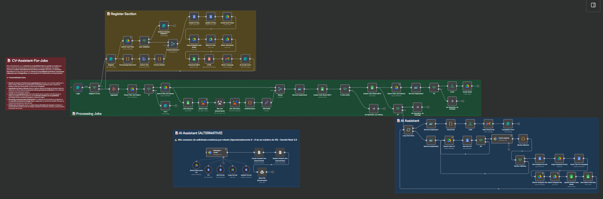

<h1 align="center">🤖 CV Assistant For Jobs</h1>

**CV Assistant For Jobs** es un flujo de trabajo automatizado para **n8n** diseñado para actuar como tu coach de carrera personal. Este sistema scrapea ofertas de empleo de Indeed (mas sitios en el futuro), gestiona el registro de usuarios, procesa hojas de vida (CVs) y utiliza Inteligencia Artificial (Google Gemini) para analizar la compatibilidad de tu perfil con múltiples ofertas de trabajo automáticamente.

## ✨ Características Principales

- **📝 Sistema de Registro y Onboarding:**
  - Formulario web para nuevos usuarios.
  - Carga y extracción de texto de CVs (PDF).
  - Creación automática de carpetas personales en Google Drive.
  - Generación de credenciales de acceso (ID único) enviadas por correo electrónico.
- **🤖 Análisis Inteligente con IA (Gemini):**
  - Compara tu perfil profesional contra los requisitos de cada oferta laboral.
  - Genera un veredicto de compatibilidad (**APTO** / **NO APTO**).
  - Crea reportes detallados con comparativas y sugerencias de mejora.
- **🌐 Integración con Google Workspace:**
  - **Drive:** Organización automática de archivos.
  - **Sheets:** Lectura de ofertas de empleo y actualización de estados.
  - **Docs:** Generación de documentos de análisis individuales para cada postulación.
  - **Gmail:** Notificaciones automáticas.

## 🛠️ Requisitos Previos

Para ejecutar este workflow, necesitas:

1.  **n8n** (Versión recomendada: última estable).
2.  **Cuentas y Credenciales:**
    - **Google Cloud Console:** Con APIs habilitadas para Drive, Sheets, Docs y Gmail.
    - **Google Gemini API:** Una API Key válida para el modelo `gemini-2.5-flash` (o similar).
    - **Apify:** Con el actor `misceres/indeed-scraper` (Con un cuenta gratuita de Apify es suficiente).
3.  **Archivos Plantilla (Google Drive):**
    - Hoja de cálculo base para el seguimiento de empleos ("[Jobs Sheet](https://docs.google.com/spreadsheets/d/1yhCW96Fzu2mwEBno1WEEs8TzlqjVPLN9dvPRPRZ5QT8/edit?gid=1202194973#gid=1202194973)").
    - Documento plantilla para el formato de análisis ("[Analyses Format](https://docs.google.com/document/d/1K64HdLvd5QPy8oMJj1HUJa2QCCXcB3YF3cgq_o-iWf8/edit?tab=t.0#heading=h.6jynaot9cbnq)").

## ⚙️ Configuración e Instalación

1.  **Importar el Workflow:**

    - Descarga el archivo `CV-Assistant-For-Jobs v2.json`.
    - En n8n, ve a **Workflows** > **Import from File** y selecciona el JSON.

2.  **Configurar Credenciales:**
    Asegúrate de configurar las siguientes credenciales en n8n:

    - `Google Drive OAuth2 API`
    - `Google Sheets OAuth2 API`
    - `Google Docs OAuth2 API`
    - `Gmail OAuth2`
    - `Google Gemini(PaLM) Api`

3.  **Ajustar IDs de Recursos:**
    El workflow hace referencia a IDs específicos de carpetas y archivos plantilla. Deberás actualizar los nodos con tus propios IDs si no estás usando el entorno original:
    - _Nodo "Copy (Original) Jobs Sheet":_ ID de la hoja de cálculo plantilla.
    - _Nodo "Get Format":_ ID del documento de formato de análisis.
    - _Nodo "Create User Folder":_ ID de la carpeta raíz donde se guardarán los usuarios.

4.  **Configurar Apify:**
    - `Apify API Key`: Puedes en el actor `misceres/indeed-scraper` en la esquina superior derecha encontrarás el botón de API Key -> API Endpoints, Segun el nombre del actor, la API Key es el valor que debes agregar en n8n.

## 🧠 Cómo Funciona

El sistema opera en dos fases principales:

### 1. Fase de Registro (`Register Section`)

- El usuario accede al Formulario de Registro.
- Ingresa sus datos (Email, Palabras clave, País) y sube su CV en PDF.
- El sistema procesa el CV, limpia el texto y crea una estructura de carpetas en Drive especifica para el usuario.
- Se envía un correo al usuario con su **Clave de Acceso (Folder ID)**.

### 2. Fase de Procesamiento (`Processing Jobs` & `AI Assistant`)

- El usuario (o el sistema programado) inicia el proceso validando su **Clave de Acceso**.
- El workflow inicia el actor `misceres/indeed-scraper` para obtener las ofertas de empleo.
- El workflow lee la lista de empleos desde la hoja de cálculo del usuario (`Indeed Jobs Sheet`).
- **Para cada oferta no analizada:**
  1.  La IA lee el CV del usuario y la descripción del empleo para generar un análisis.
  2.  Se crea una carpeta especifica por fecha de análisis.
  3.  Genera un documento de análisis basado en una plantilla.
  4.  Actualiza la hoja de cálculo con el resultado, el veredicto y el enlace al análisis.
  5.  Envía un correo al usuario con el resultado y el enlace de cada análisis por trabajo.

## 📄 Estructura del Reporte de IA

Cada análisis generado incluye:

- **Comparativa:** Puntos clave de coincidencia entre el perfil y la oferta.
- **Sugerencias:** Consejos para mejorar el perfil para esa vacante específica.
- **Veredicto:** Decisión final de compatibilidad.
- **Conclusión:** Resumen motivacional.

## 🤝 Contribución

¡Las contribuciones son bienvenidas! Si tienes ideas para mejorar el prompt de la IA o la eficiencia del flujo, no dudes en contactarme a mi correo [julio.tamara23@outlook.com](julio.tamara23@outlook.com) o a mi discord `juliotamara23`.
